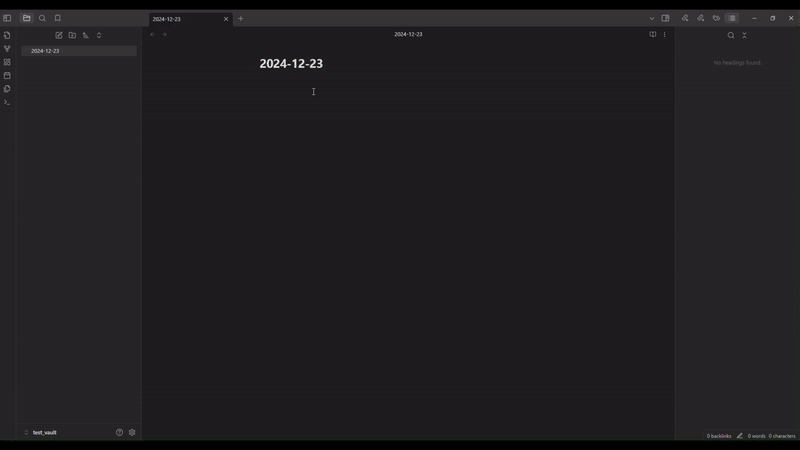

## Weekly Goal Tracker Plugin for Obsidian
This is a plugin for [Obsidian](https://obsidian.md) that allows you to add buttons to the status bar that allow you to track of different weekly goals and update them with ease. For example you could track a weekly exercise goal. The data is stored in the frontmatter of the Monday note for the current week or the current weekly note. 
## Demonstration

## Usage
- When the button is closed, it displays an icon, the current value and the goal value
- Using **left click**, the button can opened to show a progress bar in color
- While the button is open, press **right click** to +1 to the goal.
- While the button is open, hold **shift** and press **right click** to -1 from the goal
- When the goal has been reached, the button displays in color

## Settings
- Hide numbers when button is closed? : Allows you to display the buttons with the icon only when it is closed
- Use weekly note? : Allows you to use the weekly note (typically in the format eg.2024-W48) instead on the Monday note
### Activity
- Frontmatter value : the value in the frontmatter to read and write to
- Icon : the icon displayed in the status bar button. I recommend using [Emojipedia](https://emojipedia.org/) to find icons
- Goal : the weekly goal for activity
- Start color/end color : the gradient color for the status bar button, from left to right
- ʌ/v : change the order in which buttons appear in the status bar

## Bug Reports and Feature Requests
If you would like to report any bugs or request features, feel free to open an issue at https://github.com/GitGorman/weekly-goal-tracker/issues
